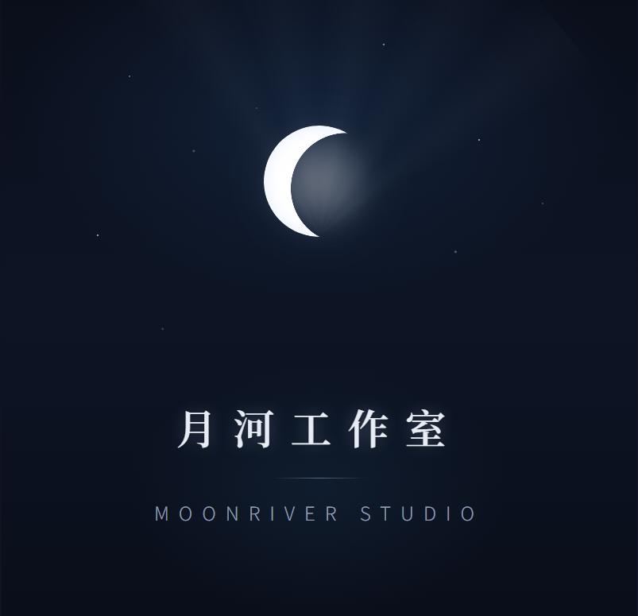

# MoonRiver-Studio.github.io
月河工作室 | 独立游戏开发者 | DragonRuby PC 游戏 | godot游戏

  

    
<strong>月河工作室 | LXGW Version</strong>

  

  

    
<strong>月河工作室 | songti Verison</strong>

  

  
  <h1>MoonRiver Studio</h1>
  
月河工作室 | 独立游戏开发者

  
目前正在制作中……

   
  <a href="https://github.com/MoonRiver-Studio/你的游戏仓库" style="color:#88f">查看开发进度</a>
    
  
更多游戏信息请关注后续更新

